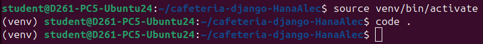

# cafeteria-django-HanaAlec

## Pour relancer un projet 

Pour activer l'env + lancer VSCode
```
student@D261-PC5-Ubuntu24:~/cafeteria-django-HanaAlec$ source venv/bin/activate
(venv) student@D261-PC5-Ubuntu24:~/cafeteria-django-HanaAlec$ code .
```

