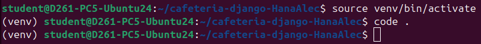

# cafeteria-django-HanaAlec

## INITIALISATION
## Pour relancer un projet 

Pour activer l'env virtuel + lancer VSCode
```
student@D261-PC5-Ubuntu24:~/cafeteria-django-HanaAlec$ source venv/bin/activate
(venv) student@D261-PC5-Ubuntu24:~/cafeteria-django-HanaAlec$ code .
```



Pour update le projet sur GitHub :

Utilisez ces commandes régulièrement :

    git add . : Ajoute tous les fichiers modifiés à l'index (staging area).
    git commit -m "Description des changements" : Enregistre les modifications avec un message descriptif.
    git push : Envoie les commits vers GitHub pour une sauvegarde en ligne.
    Faites-le après chaque fonctionnalité importante ou avant de quitter votre session de travail.


## PREMIERE SEANCE : ébauche d'organigramme (sur dbdiagramme.io)

```
Table Student {
  id int [pk]
  name varchar
  email varchar
  credit float
  shop_history list [ref: > Product.name]
}

Table Group {
  id int [pk]
  student_id int [ref: > Student.id]
  service varchar
}

Table Product {
  id int [pk]
  name varchar
  price float
  available boolean
}

Table Transaction {
  id int [pk]
  student_id int [ref: > Student.id]
  product_id int [ref: > Product.id]
  date datetime
}
```
## Deuxième séance : 31/03/2026

Organigramme modifié (suppression de la classe "Group" pour un choix de roles et classe "student" changé pour "user")
Création des templates
Ajout des produits de la cafet

## Troisième séance : 03/04/2026
Questions d'analyse :

    Quels sont les avantages d'utiliser ModelForm par rapport à un formulaire HTML manuel ?
    Comment Django valide-t-il les données côté serveur ?
    Que se passe-t-il si le formulaire n'est pas valide (données non conforme au type défini dans le modèle) ?


